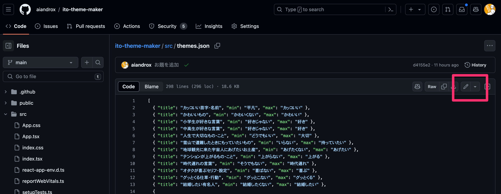
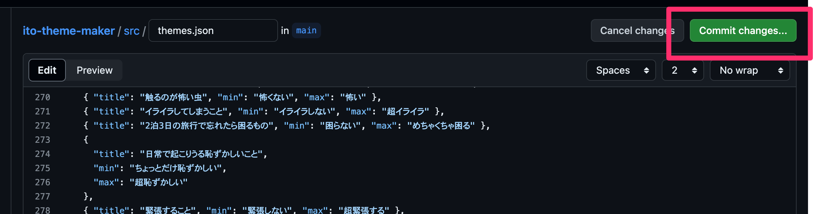
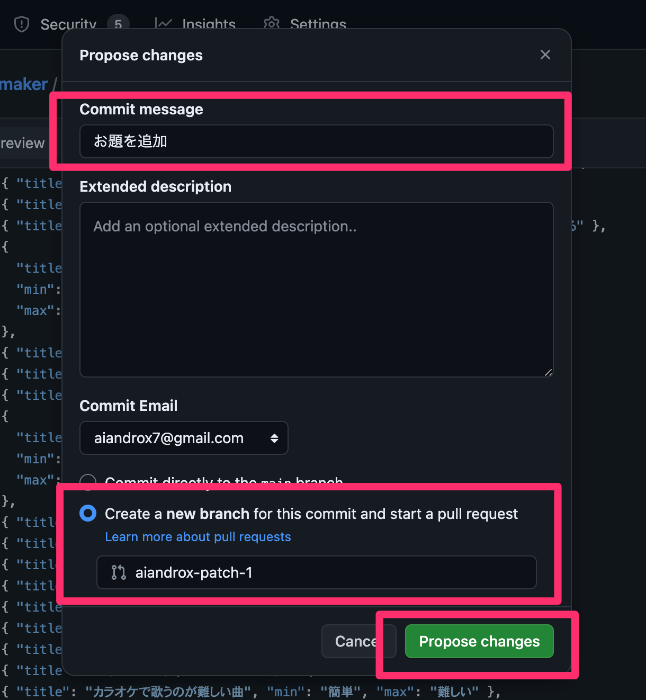
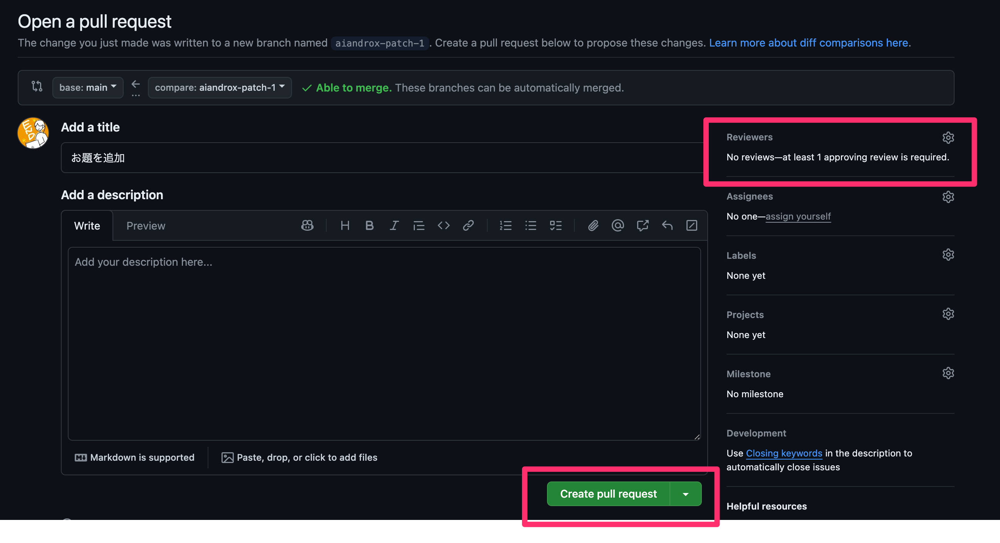

# [itoお題メーカー](https://ito-theme-maker.vercel.app/)

ボードゲームの[ito](https://arclightgames.jp/product/ito/)のお題を一覧で見れるサービスです。

## お題を追加する方法

https://github.com/aiandrox/ito-theme-maker/blob/main/src/themes.json の下記のボタンから、ファイルを編集できます



フォーマットは以下を参考にしてお題を追加してください。<br>
※ 改行する際は、末尾の`,`を忘れないように注意してください

```json
{ "title": "カッコいい苗字・名前", "min": "平凡", "max": "カッコいい" }
```

**[Commit changes...]** ボタンを押して、画像を参考にコミットしてください。





プルリクエスト作成画面に遷移するので、**[Create pull request]** ボタンを押してください。
また、画面の右側にある **[Reviewers]** に `@aiandrox` を追加してください。


