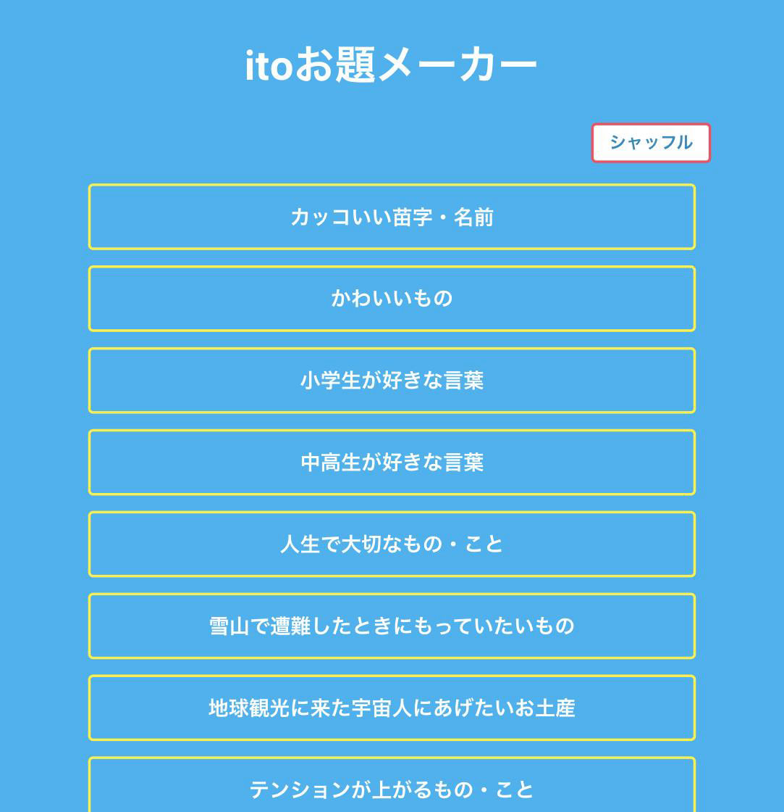
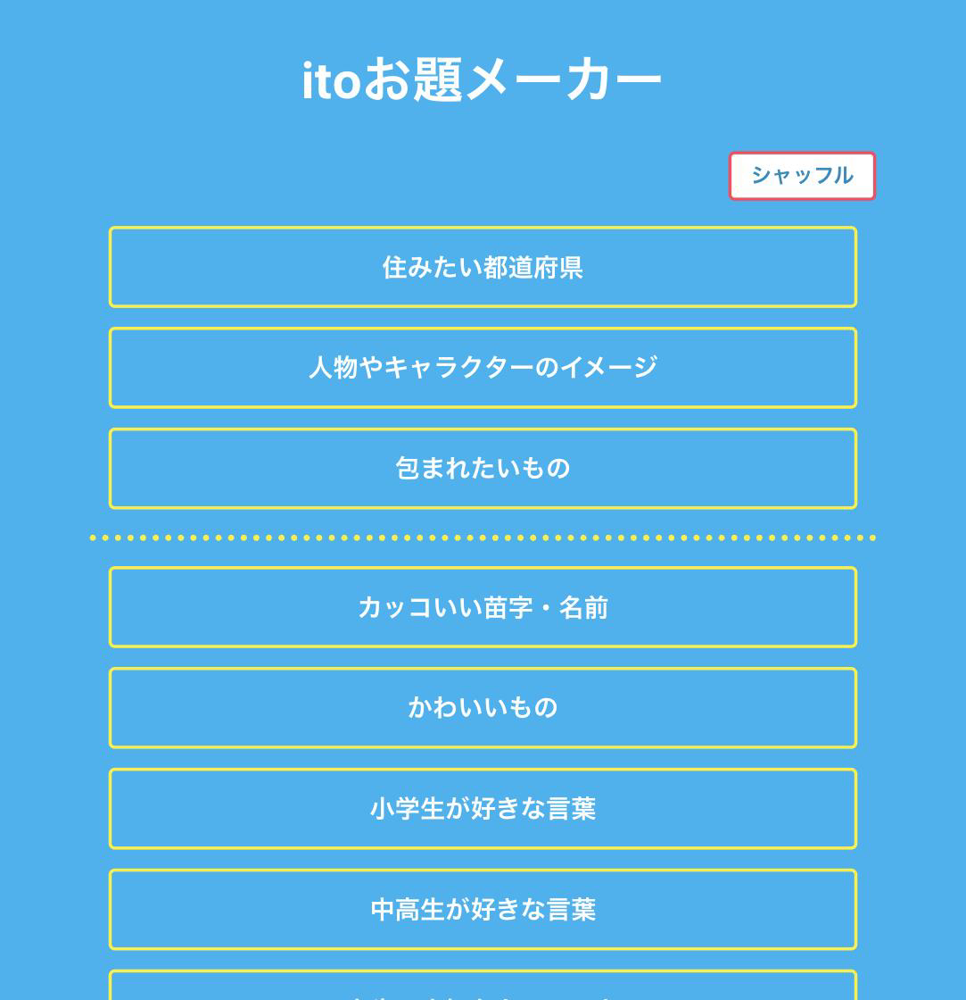
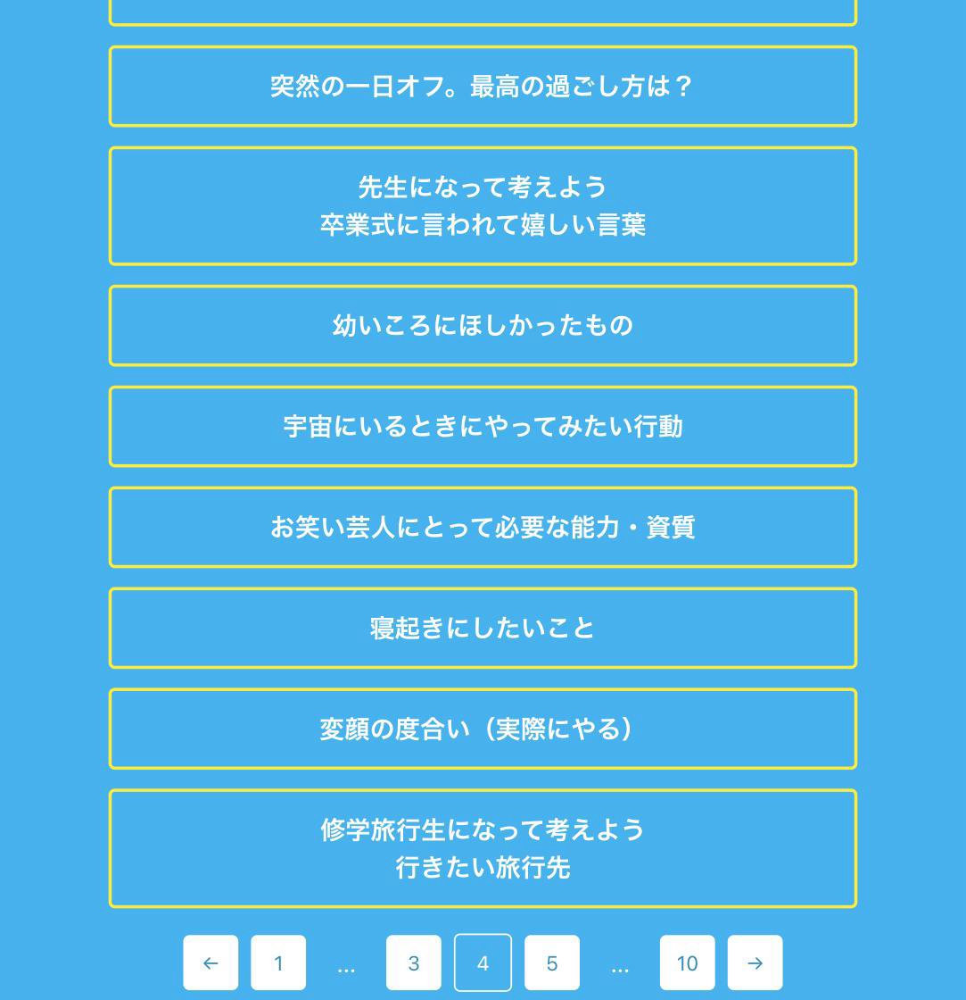
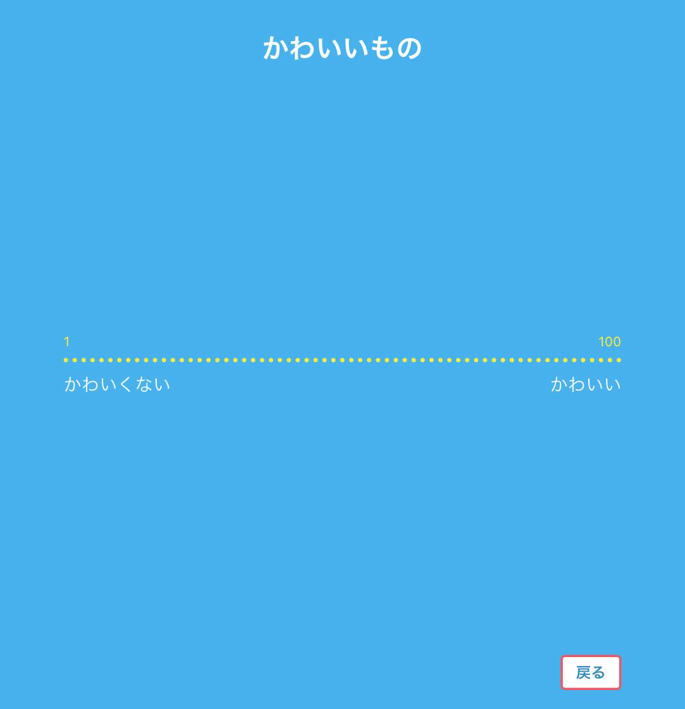
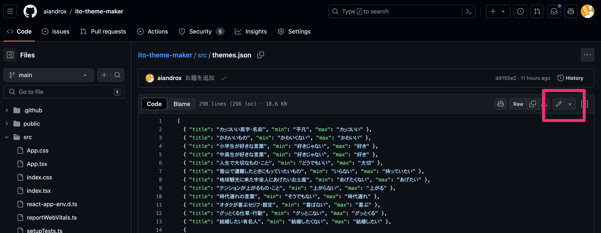
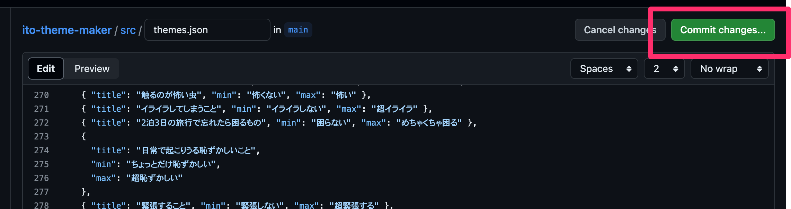
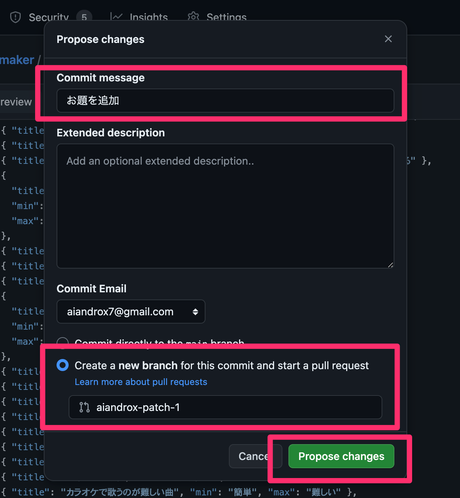
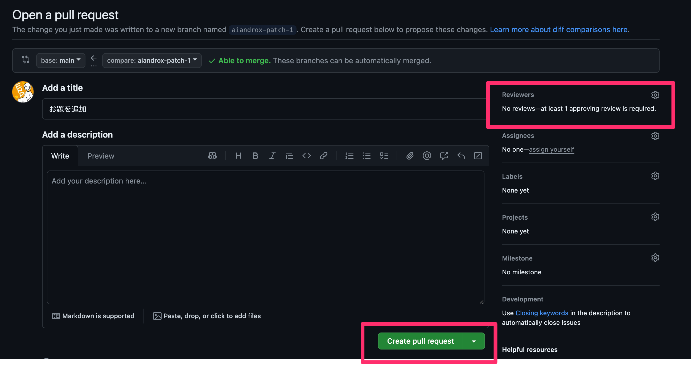

# [itoお題メーカー](https://ito-theme-maker.vercel.app/)

ボードゲームの[ito](https://arclightgames.jp/product/ito/)のお題を一覧で見れるサービスです。

## 使用画面と機能

| お題一覧 | シャッフル |
| :---: | :---: |
| [](./docs/images/theme-list.png) | [](./docs/images/shuffle.png) |
| 登録されているお題をカードで一覧表示します。各カードには、数直線の両端（小さい方・大きい方）に対応する言葉が設定されています。 | **[シャッフル]** ボタンを押すと、全お題からランダムに3つを選んで先頭に表示します。ゲームを始めるときのお題選びに使えます。 |
| ページ送り | お題詳細（数直線） |
| [](./docs/images/pagination.png) | [](./docs/images/theme-detail.png) |
| お題はページごとに表示されます。現在ページの前後と、最初・最後のページだけを表示し、間は「…」で省略します。スマホの画面幅でも折り返して収まります。 | お題をタップすると、1〜100の数直線と両端の言葉を画面いっぱいに表示します。プレイ中にそのまま盤面として使えます。詳細画面から **[戻る]** と、見ていたページの一覧に戻ります。 |

## お題を追加する方法

https://github.com/aiandrox/ito-theme-maker/blob/main/src/themes.json の下記のボタンから、ファイルを編集できます



フォーマットは以下を参考にしてお題を追加してください。<br>
※ 改行する際は、末尾の`,`を忘れないように注意してください<br>
※ `id` は既存の最大値 +1 になるように、重複しない数値を指定してください

```json
{ "id": 188, "title": "カッコいい苗字・名前", "min": "平凡", "max": "カッコいい" }
```

**[Commit changes...]** ボタンを押して、画像を参考にコミットしてください。





プルリクエスト作成画面に遷移するので、**[Create pull request]** ボタンを押してください。
また、画面の右側にある **[Reviewers]** に `@aiandrox` を追加してください。


